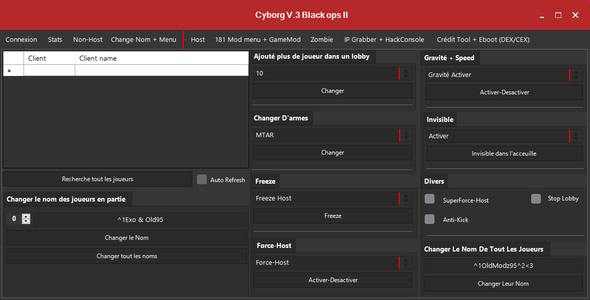

<h1 align="center">

OldModz95

</h1>
<p align="center">
  <a href="https://discord.gg/MS6TMgRfqB"></a>
</p>
<p align="center">
  <a href="https://discord.gg/M3sTyHtcK4"></a>
</p>

<br>

### Tool Cyborg V.3 Black Ops 2 -  By OldModz95 Proposed By ProtonDev

<br><br>

## REJOIGNIEZ LE SERVEUR DISCORD - JOIN SERVER DISCORD!!!!!!!!!!!!!!!!!!!!!!!!

https://discord.gg/MS6TMgRfqB
<br><br>


## 🆙 Open Project

[Download Visual Studio (min 2019)](https://visualstudio.microsoft.com/fr/downloads/)<br>
--Package C#

<br><br>

## 🔧 Information

Target Framework: .NET Framework 4.5<br>
DLL: `CCAPI` - `PS3Lib` - `ps3tmapi` - `ps3tmapi_net`<br>

<br><br>

## 👁‍🗨 IMAGE

<br>

### Home

<br>

### Stats

<br>

### Non-Host

<br>

### Change Nom + Menu

<br>

### Host

<br>

### 181 Mod Menu + GameMod

<br>

### Zombie

<br>

### IP Grabber + HackConsole

<br>

### Crédit Tool + Eboot (Dex/Cex)

<br>
<br>

# FRANCAIS
```
Je ne fournirais aucun support sur son fonctionnement et la mise en place de cette source.
J'ai fait exprès de retiré les fonctions DLL lié au CCAPI/PS3.
J'ai sorti cette source pour vous permettre de prendre du code et vous donnez de l'inspiration.
Cette source date de septembre 2019.
Proposer par OldModz95 & ExoTiQueModz.

Cette source est proteger par sont développeur.
Ce qui veux dire, que vous avez aucun droit de re-publié sa source ou de l'utiliser à des fin commercial.
```

<br>
<br>

# ENGLISH
```
I would not provide any support on how it works and how to set up this source.
I purposely removed the DLL functions linked to the CCAPI/PS3.
I released this source so that you can take some code and give you some inspiration.
This source is from September 2019.
Proposed by OldModz95 & ExoTiQueModz.

This source is protected by its developer.
Meaning, you have no right to re-publish its source or use it for commercial purposes.
```

<br>
<br><br>

# Function/Fonction

### Connexion
`CCAPI` - `TMAPI` - `Connexion/Attacher/Anti-Ban/Deconnexion`
<br>

### CCAPI Notif
`Random Text` - `Info/Caution/Friend/Slider/Wrong Way/Dialog/Dialog Shadow/Text/Pointer/Grab/Hand/Pen/Finger/Arrow/Arrow Right/Progress`
<br>

### Other
`Change CID` - `Temp PS3 (V console/CLL/RSX)` - `Connexion By IP`
<br><br>

## Stats Multi

`Prestige` - `Victoire` - `Défaite` - `Kills` - `Mort` - `Score` - `HeadShots` - `Temps joueur` - `Changer de niveaux` - `Stats avancer (Random stats)` - `Débloquer (armes/camo)` - `Nom de classe` - `Stats en ligue (série de victoire/carriere/saison/point ligue)` - `Grade Ligue` - `Amusement (Flash Préstige/Niveau/Boutton)`
<br><br>

## Change Nom

`Changer de nom normalement + flash` - `Changer les FPS` - `Changer sa marque de cla` - `Code couleur` - `Modifier l'écriture du menu principal` - `Nom prédéfini Porno/Insulte/Lobby` - `Nom Freeze box` - `Nom image`

<br><br>

## Host

`Rechercher tout les joueurs` - `Changer le nom des joueurs en partie` - `Ajouter plus de joueur dans le lobby` - `Cgabger d'armes` - `Gravité + Speed` - `Invisible` - `Divers` - `Force-Host` - `Changer le nom de tout les joueurs`

<br><br>

## 181 Mod Menu + GameMod

### 181 Modes Menu injectable

```
0 Cyborg V1
1 Mode Menu Bossam V1
2 Mode Menu Bossam V6
3 Mode Menu ELeGanCe Patch
4 Mode Menu ELeGanCe v3
5 Mode Menu Elegance V5
6 Mode Menu Alca v2
7 Mode Menu Aviation v1.5
8 Mode Menu BAREFACE LEO
9 Mode Menu Blue Sky V1
10 Mode Menu Cairo Patch
11 Mode Menu Caked Up
12 Mode Menu Closing Time v1
13 Mode Menu Codeine Crazy
14 Mode Menu CodeMods v1
15 Mode Menu Confusion
16 Mode Menu Corrupted v3
17 Mode Menu Creation V1 Beta
18 Mode Menu Dark Moon V1
19 Mode Menu Deep ocean v1
20 Mode Menu Deeznutz v1
21 Mode Menu EnCoReV2.3 BETA
22 Mode Menu ERUPTIONV2
23 Mode Menu Experience
24 Mode Menu Exploit V1
25 Mode Menu Explosive
26 Mode Menu ferrox V1
27 Mode Menu FlamezV1
28 Mode Menu Free All
29 Mode Menu Fuck Sony v3
30 Mode Menu Hydro
31 Mode Menu INFINITI
32 Mode Menu JiggyMenuV4.2
33 Mode Menu Kamamama
34 Mode Menu Matrix Trickshot
35 Mode Menu MWS Menu
36 Mode Menu Night v1
37 Mode Menu NinjaModzv1
38 Mode Menu Predator v3
39 Mode Menu Project Dream
40 Mode Menu Project Lethal v2
41 Mode Menu Project Smash V2
42 Mode Menu Project X
43 Mode Menu ProjectExcellence
44 Mode Menu ProjectIlluminati
45 Mode Menu ProjectMellow
46 Mode Menu Projetescape
47 Mode Menu Red-Rooster V1.2
48 Mode Menu Ride My Bicycle V2
49 Mode Menu T6rojan
50 Mode Menu Destinition
51 Mode Menu BELGUIM
52 Mode Menu Blue Sky V2
53 Mode Menu Bossam V4
54 Mode Menu Breaking Earth V1.1
55 Mode Menu Capofication V2 
56 Mode Menu Dark Shadows v1
57 Mode Menu Death Cry V1 BETA
58 Mode Menu Degeneration v1.1 BETA
59 Mode Menu DMT V1
60 Mode Menu Dreadnought V3
61 Mode Menu Dreadnought V4
62 Mode Menu Extincts
63 Mode Menu Frosty V1
64 Mode Menu FroZ v1
65 Mode Menu FroZ v2
66 Mode Menu GermanModzHD
67 Mode Menu HostOnlys Private
68 Mode Menu Hunaveli
69 Mode Menu Iconic
70 Mode Menu Illuison V1
71 Mode Menu Legend
72 Mode Menu Lost Memories Love
73 Mode Menu LoveOrHatebyxKraveModz
74 Mode Menu Masacre
75 Mode Menu Mod Menu xTvxyv 1
76 Mode Menu Overdrive v1
77 Mode Menu PlasmaMods V3
78 Mode Menu Project Hiqh v1
79 Mode Menu Project Lemon v1
80 Mode Menu Project Old
81 Mode Menu Project Reeko v2
82 Mode Menu Project Unity
83 Mode Menu ProjectAqua
84 Mode Menu Purlple Kuch v4
85 Mode Menu Rawdog
86 Mode Menu Reborn v1
87 Mode Menu Red Tear v2.1
88 Mode Menu Silent Menu v1.8
89 Mode Menu Silent Shadow
90 Mode Menu Space Bound v1
91 Mode Menu SSM The Cypher
92 Mode Menu Syzygyv2
93 Mode Menu TheLastOreoV3
94 Mode Menu Toxic v1
95 Mode Menu Unbound User v4
96 Mode Menu Velocity V2
97 Mode Menu VerificationModz
98 Mode Menu Waterfall v1
99 Mode Menu Waves
100 Mode Menu Alca V3
101 Mode Menu arctic v3
102 Mode Menu Army
103 Mode Menu Blazed V1
104 Mode Menu Bossam V3
105 Mode Menu Bossam V5
106 Mode Menu Code Green
107 Mode Menu Crisis
108 Mode Menu Delusion
109 Mode Menu DiizyMoDz v1
110 Mode Menu Dynamic v2
111 Mode Menu Dynamic V3.1
112 Mode Menu Dynamic V3.3
113 Mode Menu enslaved
114 Mode Menu Escalation v1
115 Mode Menu Exotic V1
116 Mode Menu Exotic V2 BETA
117 Mode Menu Extinct's S&D
118 Mode Menu FREEFALL
119 Mode Menu Genesis
120 Mode Menu HexyModz Private Patch v2
121 Mode Menu HostOnly's Private
122 Mode Menu IMT V2
123 Mode Menu JR JS V5
124 Mode Menu JR JS V6
125 Mode Menu Legends Curse V1 Beta 2
126 Mode Menu Luckyshot
127 Mode Menu Masacre v1 zomboe
128 Mode Menu Nyctophilia
129 Mode Menu oCmKs 4 Lifes Private Patch
130 Mode Menu Predator v1.3
131 Mode Menu Predator v2
132 Mode Menu Predator v6.51
133 Mode Menu Project Escape V3
134 Mode Menu Project Hydra
135 Mode Menu Project Snow V1
136 Mode Menu Project Stoner v1
137 Mode Menu Project TCM V1
138 Mode Menu Project Ultimate
139 Mode Menu Project Unlimited v1.5.4
140 Mode Menu Project Untlimited v1.4.2
141 Mode Menu Project Zombee
142 Mode Menu Purple Dragon
143 Mode Menu RDC V6.7
144 Mode Menu rebelv1
145 Mode Menu RedDotCity v2
146 Mode Menu Redemption V1.8
147 Mode Menu Sky High v2
148 Mode Menu SS Billcam CONSUMER EDITION 1
149 Mode Menu SSM Millennium
150 Mode Menu Synthbreaker v1
151 Mode Menu TheLastOreoV2
152 Mode Menu TogetherPrivate Patch
153 Mode Menu Trojan
154 Mode Menu Unknown Modding
155 Mode Menu Unreleased
156 Mode Menu WhiteWater v5.5
157 Mode Menu xePixTvx's Private Menu
158 Mode Menu arctic v3
159 Mode Menu Corrupted v3 BETA 1.5
160 Mode Menu Anti-Fed V1
161 ProjectFroZv1
162 ProjectFroZv2
163 ProjectHunaveli
164 Projecticonic
165 ProjectLemonv1
166 CyanEdition
167 PurpleEdition
168 RedEdition
169 ProjectUnity
170 ProjectWaves
171 Reblunted
172 Syzygyv2compiled
173 VelocityV2
174 Synthbreake
175 army v4
176 Daniel Wasa
177 Destiny By Enston
178 Lyberta V2
179 HostOnlys Trickshot
180 Revolution
181 PS3DOWN.FR V4
```

<br><br>

### Mode Menu Favorie

```
Oldlast V1
Cyborg V1
Zario V1.0
Bossam V6
Bossam V4
Elegance V3
Elegance V5
```
<br><br>

### 22 Games Modes injectable

```
ZombieLand (MME)
Game Border Patrol
Game Dodgeball  (Mele General)
Haunted (MME)
Hide and Seek (MME)
Hunger Games (Mele General)
Mario Kart (MME)
The Golden Gun (Mele General)
XPLobby (MME)
Bounce Mod
EB Game (Mele General)
Floater Game
Floor Lave Game
Nuketown Survival Game (MME)
Prison Break Game
Superman 1v1 Game (MME)
Tricky Myers Game Mele General)
Original Zombieland Game
Sex Game  (Mele General)
Superman Game  (Mele General)
Crusher (MME)
Parcour  (Mele General)
```

<br>
<br><br>

## Zombie

### Stats Zombies

`Atouts` - `Balles` - `Blessure` - `Coups` - `Tir Tete` - `Gibs` - `Granades` - `Kills` - `Miles` - `Stats avancer` - `Mort` - `Porte` - `Réanimer`
<br>

 - `Changer de nom`  - `Force host`

<br><br>

 ### Clients Zombie

`Recherche tout les joueurs` - `Afficher la checkbox sur tout les joueurs` - `Freezer les joueurs` - `Gravité` - `Time scale` - `Slow motion` - `Mele range` - `Mode vole 'fly mode)` - `Faire lag les joueurs` - `Tout les joueurs en 3e personne` - `tout les joueur à 1 000 000 $` - `tout les joueur balle illimité` - `tout les joueurs invincible` - `Changer le nom de tout les joueurs` - `Relancer la partie`

<br><br>

## IP Grabber + HackConsole

 `Trouver les IP` - `Supprimer la liste des IP` - `Géolocaliser sont IP` - `IP Logger` - `Hack Console (CEX/DEX)`


 <br><br>

 ### Eboot BLES01717 (CEX) / Eboot DEX


<br>
<br><br>

## 📞 Contact me

[Discord](https://www.discord.gg/MS6TMgRfqB)
[Twitter](https://twitter.com/oldmodz95)
<br>

<br />

## 🔧 Technologies & Tools


###### Version control system


###### License


###### Operating systems


## &#x1f4c8; GitHub Stats

<a href="https://github.com/OldModz95-YTB">
  
</>
<a href="https://github.com/OldModz95-YTB">
  
</a>

<p align="left">  </p>
